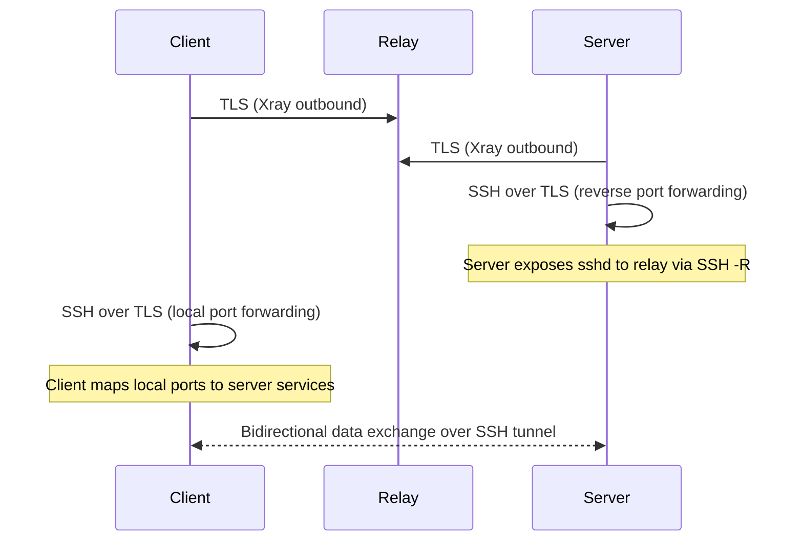

# High level Architecture 

The architecture uses Xray as a resilient, outbound-only TLS (port 443) transport to a central relay. SSH is layered on top to perform reverse port forwarding, allowing a server’s sshd to be securely accessed by a client through the relay, without exposing any non-HTTPS ports on the public internet.

All connectivity is egress-only from both client and server, making the design compatible with strict firewalls, NAT, and DPI-controlled environments.

### Key Properties

* **Only port 443 is publicly exposed**
* **No inbound connectivity** to client or server
* **SSH handles session security and port semantics**
* **Xray provides transport resilience and firewall traversal**
* **Relay never initiates connections**

