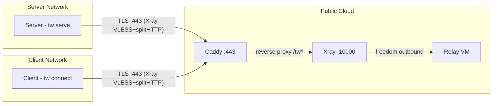

# Architecture Overview

Tunnel Whisperer creates resilient, application-layer bridges for specific ports across separated private networks. It encapsulates traffic in standard HTTPS to traverse strict firewalls, NAT, and DPI-controlled environments.

The system connects a **server** behind a private network to **clients** behind other private networks via a publicly reachable **relay**. All connectivity is egress-only from both sides.

## Documentation Sections

| Section | Description |
| ------- | ----------- |
| [System Context](system-context.md) | Goals, quality attributes, system scope, and protocol breakdown |
| [Solution Strategy](solution-strategy.md) | Challenge-to-solution mapping with technology choices |
| [Building Blocks](building-blocks.md) | Component overview, project structure, and module responsibilities |
| [Runtime Views](runtime-views.md) | Sequence diagrams for provisioning, connection, and reconnection flows |
| [Deployment](deployment.md) | Configuration, file layout, Terraform templates, and build targets |
| [Cross-cutting Concerns](cross-cutting.md) | Reconnection, security, config change detection, dashboard architecture |

!!! note "Template"
    This documentation follows the [arc42](https://arc42.org) architecture documentation template.
