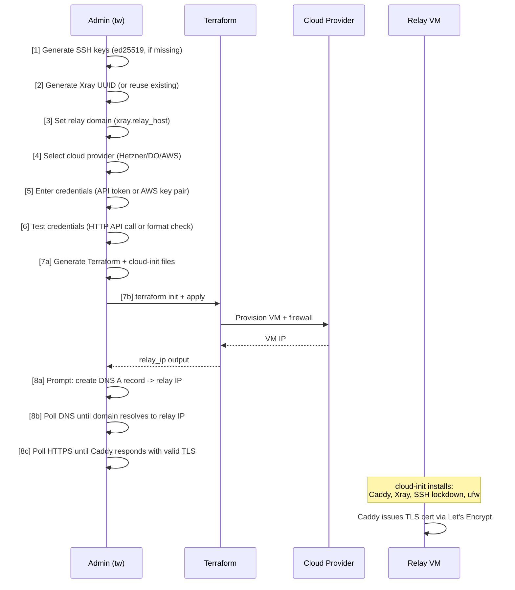
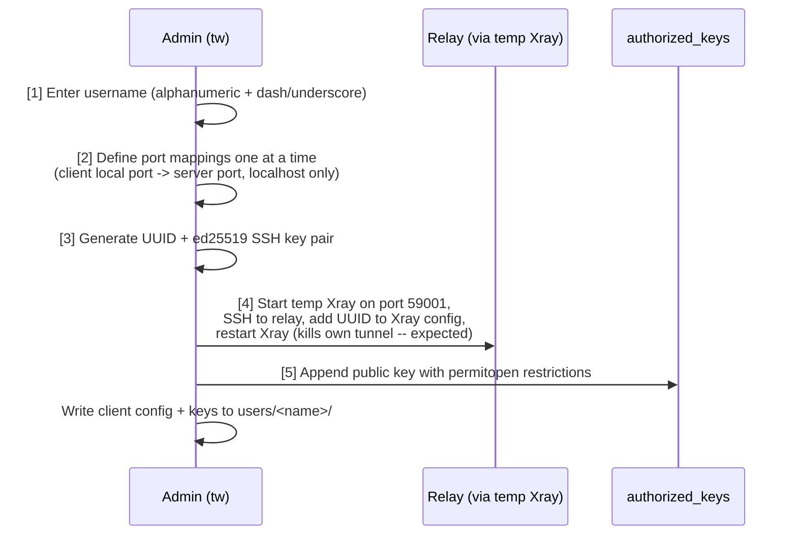
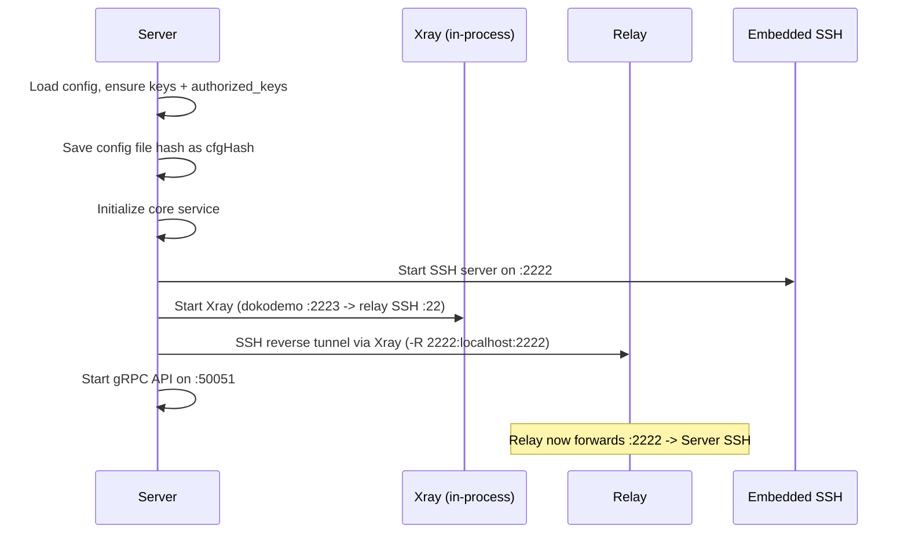
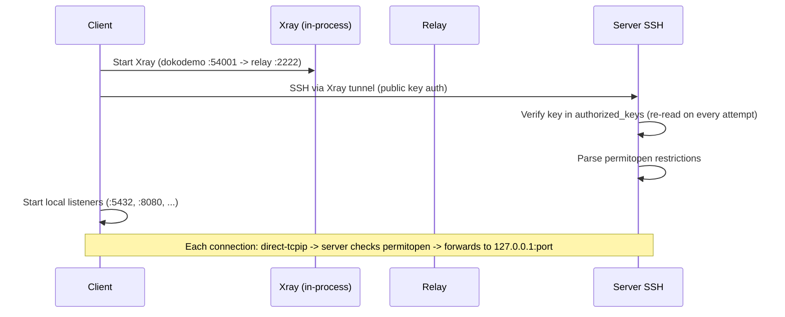
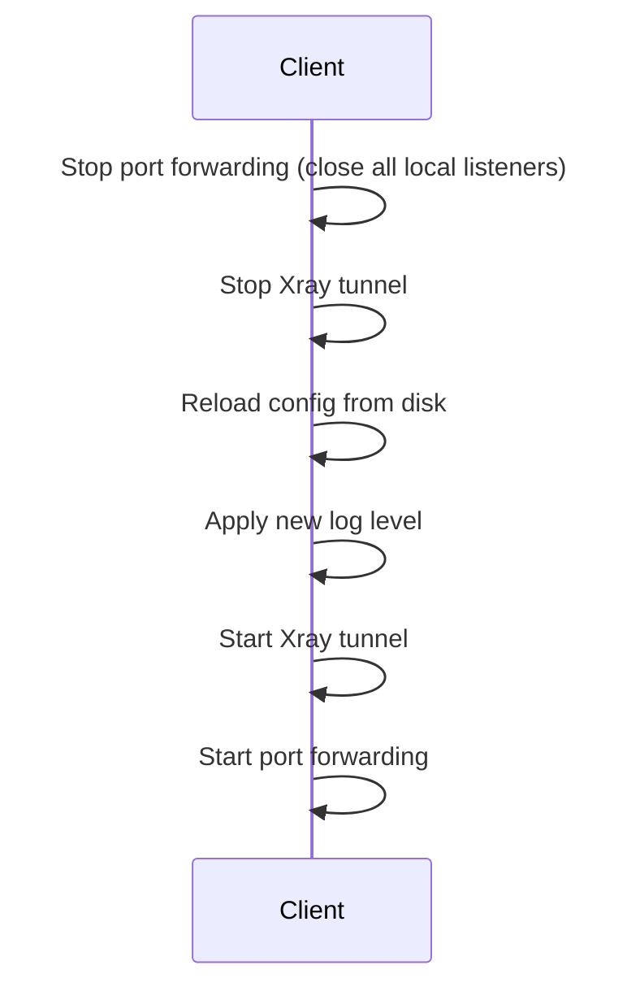

# Runtime Views

## Relay Provisioning (`tw create relay-server`)

Interactive 8-step wizard. Requires Terraform in PATH.



**Pre-check:** If a relay already exists (terraform.tfstate present in relay directory), the wizard offers to destroy and recreate. For AWS, destruction requires re-entering credentials (passed via env vars). For Hetzner/DO, credentials are read from the existing `terraform.tfvars`.

**Credential testing:** Hetzner and DigitalOcean tokens are tested with a live API call (GET to their servers/account endpoint with Bearer auth). AWS credentials are format-checked (key ID length >= 16, secret length >= 30); full validation happens during `terraform apply`.

**File generation:** The wizard calls `terraform.Generate()` which renders:

- `cloud-init.yaml` -- from `cloud-init.yaml.tmpl` with baked values (UUID, domain, Xray path, SSH user, public key)
- `main.tf` -- the selected provider's template (static, no rendering needed)

Credentials are stored as:

- Hetzner/DO: `terraform.tfvars` in the relay directory (e.g. `hcloud_token = "..."`)
- AWS: passed via `AWS_ACCESS_KEY_ID` and `AWS_SECRET_ACCESS_KEY` environment variables to `terraform` commands

The cloud-init script on the relay:

1. Creates the SSH user with the server's public key and passwordless sudo
2. Installs Caddy from official apt repo, Xray via official install script
3. Writes Xray config (VLESS inbound on `127.0.0.1:10000`, splitHTTP transport, freedom outbound)
4. Writes Caddyfile (`<domain> { reverse_proxy /tw* 127.0.0.1:10000 }`)
5. Locks down SSH to `127.0.0.1` only, disables password authentication
6. Configures firewall: deny all incoming, allow 80/tcp + 443/tcp

---

## User Creation (`tw create user`)

Interactive 5-step wizard:



**Port mapping flow:** Ports are entered one mapping at a time in sequence. For each mapping, the wizard asks for the client's local port and the server port. The remote host is locked to `127.0.0.1` -- clients cannot forward to the server's wider network.

**Relay update mechanism:**

1. Starts a temporary Xray instance on port 59000 (dokodemo-door on 59001) to avoid conflicts with a running `tw serve`
2. SSHs into the relay through the temporary tunnel using the server's private key
3. Reads `/usr/local/etc/xray/config.json` via `sudo cat`
4. Parses the JSON, adds the new UUID to `inbounds[0].settings.clients[]`
5. Writes the updated config via `sudo tee`
6. Hot-adds the UUID via the Xray gRPC API (`AlterInbound` / `AddUserOperation`); falls back to `systemctl restart xray` if the API call fails

**Generated files** in `<config_dir>/users/<name>/`:

- `config.yaml` -- client config with Xray settings (client UUID, relay host/port/path) and tunnel mappings
- `id_ed25519` -- client SSH private key
- `id_ed25519.pub` -- client SSH public key

The generated `authorized_keys` entry:

```text
permitopen="127.0.0.1:5432",permitopen="127.0.0.1:8080" ssh-ed25519 AAAA... alice@tw
```

This restricts the client to forwarding only to the specified `127.0.0.1` ports on the server.

---

## Server Startup (`tw serve`)



**Key generation:** On first run, `ensureKeys` generates an ed25519 SSH key pair (`id_ed25519` / `id_ed25519.pub`), an SSH host key (`ssh_host_ed25519_key`), and seeds `authorized_keys` with the server's own public key.

**Xray configuration:** The server-side Xray creates a dokodemo-door inbound on `sshPort+1` (default 2223) that forwards to the relay's SSH port (default 22) via VLESS+splitHTTP+TLS outbound.

**UUID auto-generation:** If `xray.uuid` is empty when `tw serve` starts with `relay_host` configured, a UUID is generated and saved to config automatically.

---

## Client Connection (`tw connect`)



**Multi-mapping over single session:** The client opens a single SSH session and creates multiple local listeners -- one per tunnel mapping. All port forwards share the same SSH connection.

**Client-side Xray:** The dokodemo-door inbound listens on `:54001` (constant `ClientListenPort`) and forwards to the server's SSH port on the relay (default 2222, configured as `client.server_ssh_port`).

---

## Client Reconnect

When the client detects a connection failure (SSH keepalive timeout or transport error), it performs a full teardown and rebuild:



!!! note "Backoff"
    Reconnection uses exponential backoff: 2s, 4s, 8s, 16s, up to a maximum of 30s between attempts. See [Cross-cutting Concerns](cross-cutting.md#auto-reconnection) for details.

---

## Data Flow (End-to-End)

```text
Client app                                                            Server service
    |                                                                       ^
    v                                                                       |
localhost:5432 --> SSH channel (direct-tcpip) --> 127.0.0.1:5432
    |                        |                            ^
    v                        v                            |
Xray dokodemo    VLESS+splitHTTP+TLS     Xray freedom    SSH reverse tunnel
(:54001)         ----------------->      (:10000)        (:2222 on relay)
                      Relay                                     |
                  Caddy :443                                    |
                  (TLS termination)                    Server SSH :2222
```
