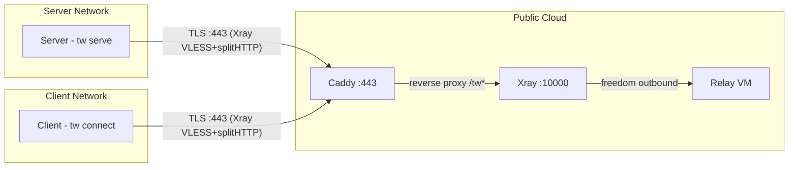

# System Context

## Introduction and Goals

Tunnel Whisperer creates resilient, application-layer bridges for specific ports across separated private networks. It encapsulates traffic in standard HTTPS to traverse strict firewalls, NAT, and DPI-controlled environments.

### Requirements Overview

The system connects a **server** behind a private network to **clients** behind other private networks, via a publicly reachable **relay**. All connectivity is egress-only from both sides. The relay is provisioned and managed by the server operator via an interactive CLI wizard or the web dashboard.

### Quality Goals

| Priority | Goal | Description |
| -------- | ---- | ----------- |
| 1 | Firewall traversal | Only port 443 (HTTPS) is exposed; compatible with strict corporate firewalls and DPI |
| 2 | Zero inbound ports | Neither client nor server requires any inbound connectivity |
| 3 | Transport resilience | Xray provides robust tunneling over TLS/splitHTTP, surviving network disruptions |
| 4 | Session security | SSH handles authentication, encryption, and port-level access control |
| 5 | Per-user lockdown | Each client is restricted to specific localhost ports via `permitopen` |

---

## System Scope and Context

### Business Context

### Technical Context

| Protocol | Port | Direction | Purpose |
| -------- | ---- | --------- | ------- |
| TLS (Xray VLESS+splitHTTP) | 443 | Server -> Relay | Transport tunnel for SSH reverse forwarding |
| TLS (Xray VLESS+splitHTTP) | 443 | Client -> Relay | Transport tunnel for SSH local forwarding |
| HTTPS (Caddy) | 443 | External -> Relay | TLS termination, reverse proxy to Xray |
| HTTP | 80 | External -> Relay | ACME challenge for Let's Encrypt certificate issuance |
| SSH (over Xray) | -- | End-to-end | Reverse/local port forwarding and session security |
| SSH (embedded) | 2222 | Local | Server's embedded SSH server (Go `x/crypto/ssh`) |
| gRPC | 50051 | Local | Server API for dashboard and tooling |
| gRPC | 10085 | Relay-local | Xray Stats API for online user tracking (tunneled via SSH) |

!!! warning "Not exposed on the relay"
    SSH port 22 is bound to `127.0.0.1` only and reachable exclusively through the Xray tunnel. The relay firewall allows only ports 80 and 443.
