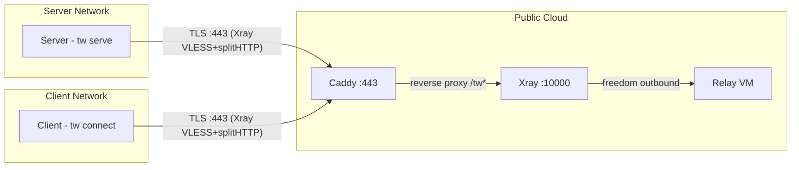
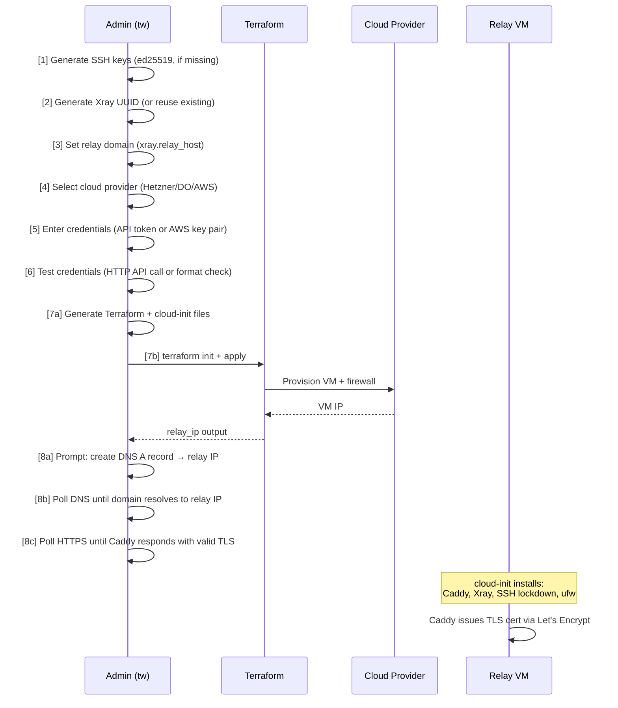
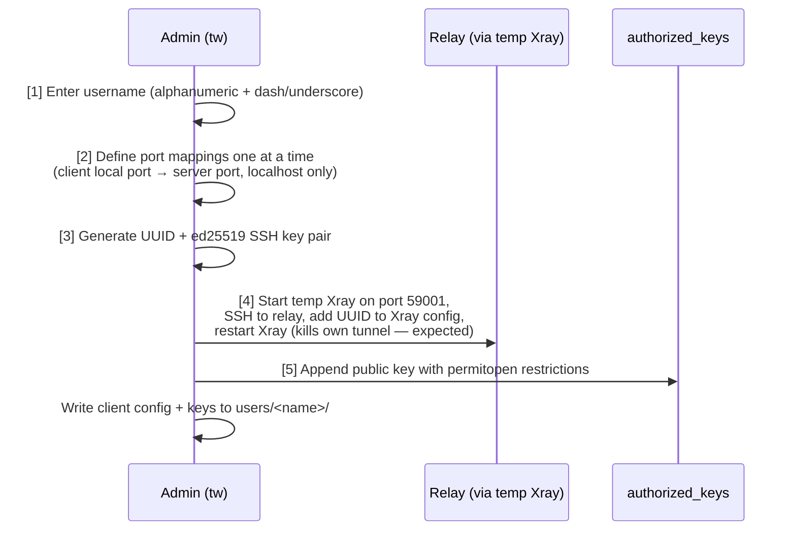
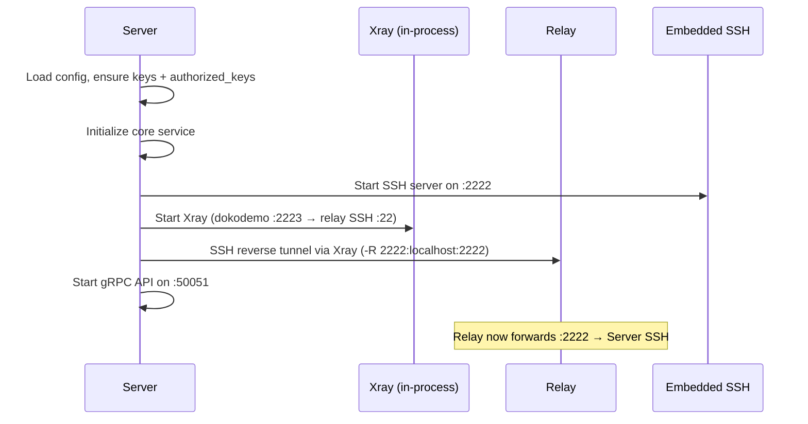
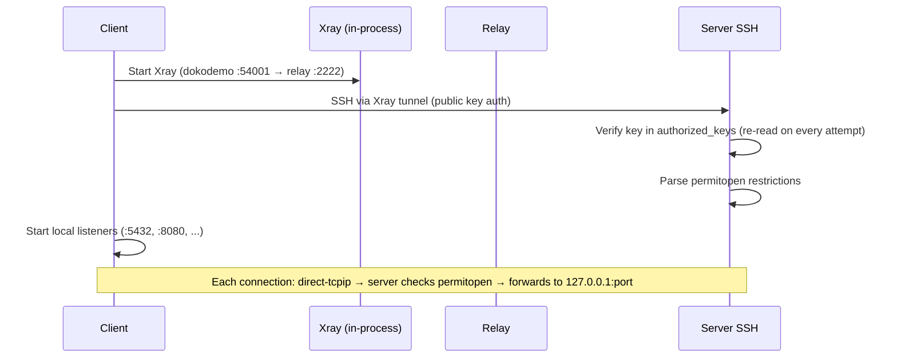

# Tunnel Whisperer — Architecture

> Based on the [arc42](https://arc42.org) template.

---

## 1. Introduction and Goals

Tunnel Whisperer creates resilient, application-layer bridges for specific ports across separated private networks. It encapsulates traffic in standard HTTPS to traverse strict firewalls, NAT, and DPI-controlled environments.

### 1.1 Requirements Overview

The system connects a **server** behind a private network to **clients** behind other private networks, via a publicly reachable **relay**. All connectivity is egress-only from both sides. The relay is provisioned and managed by the server operator via an interactive CLI wizard.

### 1.2 Quality Goals

| Priority | Goal | Description |
| -------- | ---- | ----------- |
| 1 | Firewall traversal | Only port 443 (HTTPS) is exposed; compatible with strict corporate firewalls and DPI |
| 2 | Zero inbound ports | Neither client nor server requires any inbound connectivity |
| 3 | Transport resilience | Xray provides robust tunneling over TLS/splitHTTP, surviving network disruptions |
| 4 | Session security | SSH handles authentication, encryption, and port-level access control |
| 5 | Per-user lockdown | Each client is restricted to specific localhost ports via `permitopen` |

---

## 3. System Scope and Context

### 3.1 Business Context



### 3.2 Technical Context

| Protocol | Port | Direction | Purpose |
| -------- | ---- | --------- | ------- |
| TLS (Xray VLESS+splitHTTP) | 443 | Server → Relay | Transport tunnel for SSH reverse forwarding |
| TLS (Xray VLESS+splitHTTP) | 443 | Client → Relay | Transport tunnel for SSH local forwarding |
| HTTPS (Caddy) | 443 | External → Relay | TLS termination, reverse proxy to Xray |
| HTTP | 80 | External → Relay | ACME challenge for Let's Encrypt certificate issuance |
| SSH (over Xray) | — | End-to-end | Reverse/local port forwarding and session security |
| SSH (embedded) | 2222 | Local | Server's embedded SSH server (Go `x/crypto/ssh`) |
| gRPC | 50051 | Local | Server API for dashboard and tooling |

**Not exposed on the relay:** SSH port 22 is bound to `127.0.0.1` only and reachable exclusively through the Xray tunnel. The relay firewall allows only ports 80 and 443.

---

## 4. Solution Strategy

| Challenge | Solution | Technology |
| --------- | -------- | ---------- |
| Firewalls block non-HTTPS traffic | Encapsulate all traffic in TLS on port 443 | Xray (VLESS + splitHTTP) |
| Server and client are behind NAT | All connections are outbound-only; relay is the rendezvous point | SSH reverse port forwarding |
| Relay must never see plaintext | End-to-end encryption between client and server | SSH session layer |
| TLS certificates for the relay | Automatic issuance and renewal | Caddy (ACME / Let's Encrypt) |
| Per-user access control | Public key auth with port restrictions | SSH `authorized_keys` + `permitopen` |
| Infrastructure provisioning | Interactive wizard generates Terraform + cloud-init | Terraform (Hetzner, DigitalOcean, AWS) |
| Cross-platform operation | Single binary for both server and client | Go (Linux + Windows) |
| Dynamic user management | Re-read authorized_keys on every auth attempt | No server restart needed |

---

## 5. Building Block View

### 5.1 Level 1 — System Overview

#### Server (`tw serve`)

The server brings up four internal services:

* **SSH Server** — an embedded SSH server (Go `golang.org/x/crypto/ssh`) that listens on a configurable port (default `:2222`), supports `direct-tcpip` port forwarding, reads `authorized_keys` dynamically, and enforces `permitopen` restrictions per client key
* **Xray Instance** — in-process xray-core creating a VLESS+splitHTTP+TLS tunnel to the relay; dokodemo-door inbound on `sshPort+1` forwards to the relay's SSH port
* **Reverse Tunnel** — SSH reverse port forward (`-R`) through Xray, exposing the server's SSH on the relay
* **API Server** — a gRPC service exposing status and management operations

#### Relay

The relay is a lightweight cloud VM provisioned via `tw create relay-server`. It runs:

* **Caddy** — reverse proxy on `:443`, automatic TLS via Let's Encrypt, forwards `/tw*` to Xray
* **Xray** — VLESS inbound on `127.0.0.1:10000` with splitHTTP transport and freedom outbound, accepts multiple client UUIDs
* **SSH** — OpenSSH on `127.0.0.1:22` only, accessible exclusively through the Xray tunnel; password authentication disabled
* **Firewall (ufw)** — only ports 80 and 443 open

Supported cloud providers: **Hetzner**, **DigitalOcean**, **AWS**.

#### Client (`tw connect`)

The client starts:

* **Xray Instance** — in-process xray-core with dokodemo-door inbound on `:54001` forwarding to the server's SSH port on the relay
* **Forward Tunnel** — SSH local port forwards (`-L`) through Xray, mapping multiple local ports to server services over a single SSH session

### 5.2 Level 2 — Project Structure

```text
tw/
├── cmd/
│   └── tw/                         # binary entry point (main.go)
├── internal/
│   ├── cli/                        # cobra commands
│   │   ├── root.go                 # root command + flags
│   │   ├── serve.go                # tw serve
│   │   ├── connect.go              # tw connect
│   │   ├── create_relay.go         # tw create relay-server (8-step wizard)
│   │   ├── create_user.go          # tw create user (5-step wizard)
│   │   └── dashboard.go            # tw dashboard
│   ├── config/                     # YAML config, platform-specific paths
│   │   └── config.go               # Load/Save, Dir/RelayDir/UsersDir helpers
│   ├── core/                       # core service orchestrator
│   │   └── service.go
│   ├── api/                        # gRPC API service
│   │   ├── server.go
│   │   ├── service.go
│   │   └── handlers.go
│   ├── ssh/                        # SSH key generation, embedded server, tunnels
│   │   ├── server.go               # embedded SSH server with dynamic auth + permitopen
│   │   ├── forward.go              # client-side local port forwarding (-L), multi-mapping
│   │   ├── reverse.go              # server-side reverse port forwarding (-R)
│   │   └── keygen.go               # ed25519 key pair generation
│   ├── xray/                       # in-process xray-core (VLESS + splitHTTP + TLS)
│   │   └── xray.go                 # server + client config builders, instance management
│   ├── relay/
│   │   └── terraform/              # cloud-init + Terraform templates (go:embed)
│   │       ├── cloud-init.yaml.tmpl
│   │       ├── aws.tf.tmpl
│   │       ├── hetzner.tf.tmpl
│   │       ├── digitalocean.tf.tmpl
│   │       └── generate.go         # template rendering + file generation
│   ├── dashboard/                  # HTTP server serving status page
│   │   └── server.go
│   └── provider/                   # cloud provider abstraction (stubs)
├── proto/                          # gRPC protobuf definitions
│   └── api/v1/
│       └── service.proto
├── docs/
│   └── architecture/
├── go.mod
├── go.sum
└── Makefile
```

---

## 6. Runtime View

### 6.1 Relay Provisioning (`tw create relay-server`)

Interactive 8-step wizard. Requires Terraform in PATH.



**Pre-check:** If a relay already exists (terraform.tfstate present in relay directory), the wizard offers to destroy and recreate. For AWS, destruction requires re-entering credentials (passed via env vars). For Hetzner/DO, credentials are read from the existing `terraform.tfvars`.

**Credential testing:** Hetzner and DigitalOcean tokens are tested with a live API call (GET to their servers/account endpoint with Bearer auth). AWS credentials are format-checked (key ID length >= 16, secret length >= 30); full validation happens during `terraform apply`.

**File generation:** The wizard calls `terraform.Generate()` which renders:

* `cloud-init.yaml` — from `cloud-init.yaml.tmpl` with baked values (UUID, domain, Xray path, SSH user, public key)
* `main.tf` — the selected provider's template (static, no rendering needed)

Credentials are stored as:

* Hetzner/DO: `terraform.tfvars` in the relay directory (e.g. `hcloud_token = "..."`)
* AWS: passed via `AWS_ACCESS_KEY_ID` and `AWS_SECRET_ACCESS_KEY` environment variables to `terraform` commands

The cloud-init script on the relay:

1. Creates the SSH user with the server's public key and passwordless sudo
2. Installs Caddy from official apt repo, Xray via official install script
3. Writes Xray config (VLESS inbound on `127.0.0.1:10000`, splitHTTP transport, freedom outbound)
4. Writes Caddyfile (`<domain> { reverse_proxy /tw* 127.0.0.1:10000 }`)
5. Locks down SSH to `127.0.0.1` only, disables password authentication
6. Configures firewall: deny all incoming, allow 80/tcp + 443/tcp

### 6.2 User Creation (`tw create user`)

Interactive 5-step wizard:



**Port mapping flow:** Ports are entered one mapping at a time in sequence. For each mapping, the wizard asks for the client's local port and the server port. The remote host is locked to `127.0.0.1` — clients cannot forward to the server's wider network.

**Relay update mechanism:**

1. Starts a temporary Xray instance on port 59000 (dokodemo-door on 59001) to avoid conflicts with a running `tw serve`
2. SSHs into the relay through the temporary tunnel using the server's private key
3. Reads `/usr/local/etc/xray/config.json` via `sudo cat`
4. Parses the JSON, adds the new UUID to `inbounds[0].settings.clients[]`
5. Writes the updated config via `sudo tee`
6. Restarts Xray on the relay via `sudo systemctl restart xray` — this kills the VLESS tunnel being used, so the error from the restart command is intentionally ignored

**Generated files** in `<config_dir>/users/<name>/`:

* `config.yaml` — client config with Xray settings (client UUID, relay host/port/path) and tunnel mappings
* `id_ed25519` — client SSH private key
* `id_ed25519.pub` — client SSH public key

The generated `authorized_keys` entry:

```text
permitopen="127.0.0.1:5432",permitopen="127.0.0.1:8080" ssh-ed25519 AAAA... alice@tw
```

This restricts the client to forwarding only to the specified `127.0.0.1` ports on the server.

### 6.3 Server Startup (`tw serve`)



**Key generation:** On first run, `ensureKeys` generates an ed25519 SSH key pair (`id_ed25519` / `id_ed25519.pub`), an SSH host key (`ssh_host_ed25519_key`), and seeds `authorized_keys` with the server's own public key.

**Xray configuration:** The server-side Xray creates a dokodemo-door inbound on `sshPort+1` (default 2223) that forwards to the relay's SSH port (default 22) via VLESS+splitHTTP+TLS outbound.

**UUID auto-generation:** If `xray.uuid` is empty when `tw serve` starts with `relay_host` configured, a UUID is generated and saved to config automatically.

### 6.4 Client Connection (`tw connect`)



**Multi-mapping over single session:** The client opens a single SSH session and creates multiple local listeners — one per tunnel mapping. All port forwards share the same SSH connection.

**Client-side Xray:** The dokodemo-door inbound listens on `:54001` (constant `ClientListenPort`) and forwards to the server's SSH port on the relay (default 2222, configured as `client.server_ssh_port`).

### 6.5 Data Flow (End-to-End)

```text
Client app                                                            Server service
    │                                                                       ▲
    ▼                                                                       │
localhost:5432 ──▶ SSH channel (direct-tcpip) ──▶ 127.0.0.1:5432
    │                        │                            ▲
    ▼                        ▼                            │
Xray dokodemo    VLESS+splitHTTP+TLS     Xray freedom    SSH reverse tunnel
(:54001)         ─────────────────▶      (:10000)        (:2222 on relay)
                      Relay                                     │
                  Caddy :443                                    │
                  (TLS termination)                    Server SSH :2222
```

---

## 7. Deployment View

### 7.1 Configuration

Default `config.yaml`:

```yaml
xray:
  uuid: ""                       # auto-generated on first run
  relay_host: ""                 # e.g. relay.example.com
  relay_port: 443
  path: /tw

server:                          # only needed for `tw serve`
  ssh_port: 2222
  api_port: 50051
  dashboard_port: 8080
  relay_ssh_port: 22
  relay_ssh_user: ubuntu
  remote_port: 2222              # port exposed on relay for clients

client:                          # only needed for `tw connect`
  ssh_user: tunnel
  server_ssh_port: 2222          # server's SSH port on relay
  tunnels:
    - local_port: 5432           # listen on client localhost
      remote_host: 127.0.0.1    # target on server (localhost only)
      remote_port: 5432          # PostgreSQL
```

### 7.2 File Layout (Server)

```text
/etc/tw/config/                  # or C:\ProgramData\tw\config\ on Windows
├── config.yaml                  # server configuration
├── id_ed25519                   # server SSH private key
├── id_ed25519.pub               # server SSH public key
├── ssh_host_ed25519_key         # SSH host key
├── authorized_keys              # client public keys (with permitopen)
├── relay/                       # Terraform state + generated files
│   ├── main.tf                  # provider-specific Terraform
│   ├── cloud-init.yaml          # rendered cloud-init
│   ├── terraform.tfstate
│   └── terraform.tfvars         # cloud credentials (Hetzner/DO only)
└── users/                       # per-user client configs
    └── alice/
        ├── config.yaml          # client config (send to client)
        ├── id_ed25519           # client private key (send to client)
        └── id_ed25519.pub       # client public key
```

### 7.3 File Layout (Client)

```text
/etc/tw/config/                  # or C:\ProgramData\tw\config\ on Windows
├── config.yaml                  # client configuration (from server admin)
├── id_ed25519                   # client SSH private key (from server admin)
└── id_ed25519.pub               # client SSH public key
```

### 7.4 Terraform Templates

Provider-specific Terraform files are embedded in the Go binary via `go:embed` and written to the relay directory during provisioning:

| Provider | Template | Instance | Firewall |
| -------- | -------- | -------- | -------- |
| AWS | `aws.tf.tmpl` | `t3.micro`, Ubuntu 24.04, `us-east-1` | Security group: 80 + 443 ingress |
| Hetzner | `hetzner.tf.tmpl` | `cx22`, Ubuntu 24.04, `nbg1` | Hetzner firewall: 80 + 443 |
| DigitalOcean | `digitalocean.tf.tmpl` | `s-1vcpu-1gb`, Ubuntu 24.04, `fra1` | DO firewall: 80 + 443 |

All templates use `user_data = file("${path.module}/cloud-init.yaml")` and output `relay_ip`.

### 7.5 Building

Requires **Go 1.22+**.

```bash
# Linux
go build -o bin/tw ./cmd/tw

# Windows (cross-compile from Linux)
GOOS=windows GOARCH=amd64 go build -o bin/tw.exe ./cmd/tw
```

### 7.6 What `tw serve` Starts

1. Loads (or creates) `config.yaml` from the platform config directory
2. Generates an ed25519 SSH key pair (`id_ed25519` / `id_ed25519.pub`) if missing
3. Generates an ed25519 host key (`ssh_host_ed25519_key`) for the embedded SSH server
4. Seeds `authorized_keys` with the server's own public key
5. Initializes the core service
6. Starts the **embedded SSH server** on the configured port (default `:2222`)
   * Dynamic `authorized_keys` — re-read on every authentication attempt
   * `permitopen` enforcement — restricts port forwarding per client key
7. If `xray.relay_host` is set:
   * Generates UUID if missing and saves to config
   * Starts **Xray** in-process (dokodemo-door on `sshPort+1` → VLESS/splitHTTP/TLS to relay)
   * Opens an **SSH reverse tunnel** through Xray to the relay (`-R remote_port:localhost:ssh_port`)
8. Starts the **gRPC API server** on the configured port (default `:50051`)

### 7.7 What `tw connect` Starts

1. Loads config and ensures keys exist
2. Validates that `relay_host` and at least one tunnel mapping are configured
3. Generates UUID if missing
4. Starts **Xray** in client mode (dokodemo-door on `:54001` → VLESS/splitHTTP/TLS to relay, targeting `server_ssh_port`)
5. Opens a **single SSH session** through Xray to the server's embedded SSH (public key auth)
6. Starts **local port listeners** for all configured tunnel mappings, forwarding through the SSH session
7. Blocks until stopped (Ctrl-C), with automatic reconnection on failure

---

## 8. Cross-cutting Concepts

### 8.1 Auto-Reconnection

Both the forward tunnel (client) and reverse tunnel (server) implement exponential backoff reconnection:

* **Backoff:** 2s → 4s → 8s → 16s → 30s (max)
* **Keepalive:** SSH keepalive every 15 seconds; on failure, triggers reconnect
* **TCP Keepalive:** 30-second TCP keepalive on all connections
* **Forward tunnel cleanup:** On keepalive failure, all local listeners are closed first (unblocking Accept loops), then the SSH connection is closed, triggering the reconnect loop

### 8.2 Dynamic User Management

The SSH server re-reads `authorized_keys` on every authentication attempt. This means:

* `tw create user` takes effect immediately — no need to restart `tw serve`
* Revoking a user (removing their key from `authorized_keys`) takes effect on the next connection attempt
* Each key entry can have independent `permitopen` restrictions

### 8.3 Permitopen Enforcement

When the SSH server authenticates a client, it parses `permitopen` options from the matching `authorized_keys` entry and stores them in `gossh.Permissions.Extensions["permitopen"]`. On every `direct-tcpip` channel request, the server checks the target `host:port` against the permitted list. If no `permitopen` options are set (e.g., the server's own key), all destinations are allowed.

### 8.4 Relay Config Updates

`tw create user` updates the relay's Xray config remotely:

1. Starts a temporary Xray instance (dokodemo-door on port 59001, separate from `tw serve`)
2. SSHs into the relay through the temporary tunnel using the server's SSH key
3. Reads `/usr/local/etc/xray/config.json` via `sudo cat`
4. Parses the JSON, checks for duplicate UUID, adds new client entry
5. Writes the updated config via `sudo tee /usr/local/etc/xray/config.json`
6. Restarts Xray on the relay via `sudo systemctl restart xray` — this kills the VLESS tunnel, so the error is intentionally ignored

### 8.5 Transport Protocol

Xray VLESS + splitHTTP over TLS:

* **VLESS:** Lightweight proxy protocol with UUID-based authentication
* **splitHTTP:** HTTP-based transport that splits data into standard HTTP requests/responses
* **TLS:** Terminated by Caddy on the relay; SNI matches the relay domain
* **Result:** Traffic is indistinguishable from normal HTTPS browsing to firewalls and DPI

### 8.6 Key Dependencies

| Dependency | Version | Purpose |
| ---------- | ------- | ------- |
| `github.com/xtls/xray-core` | v1.8.24 | In-process VLESS + splitHTTP transport |
| `golang.org/x/crypto/ssh` | v0.31.0 | Embedded SSH server + client tunnels |
| `github.com/spf13/cobra` | v1.8.1 | CLI framework |
| `github.com/google/uuid` | v1.6.0 | UUID generation for Xray clients |
| `google.golang.org/grpc` | v1.69.2 | gRPC API server |
| `gopkg.in/yaml.v3` | v3.0.1 | Configuration file handling |
