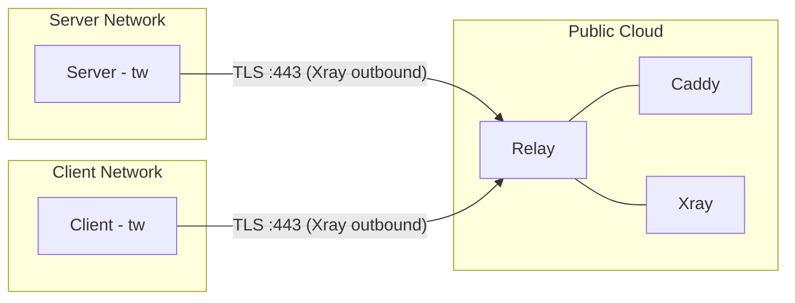
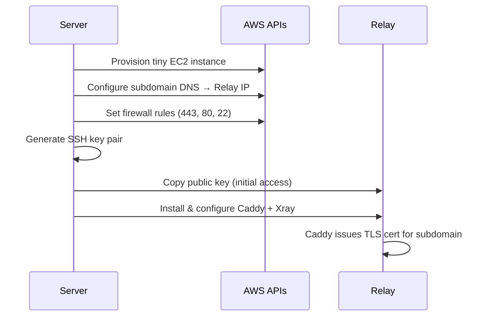
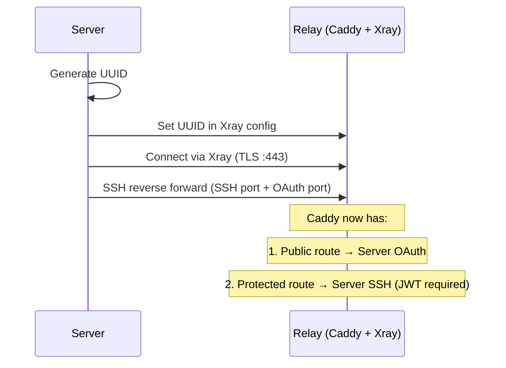
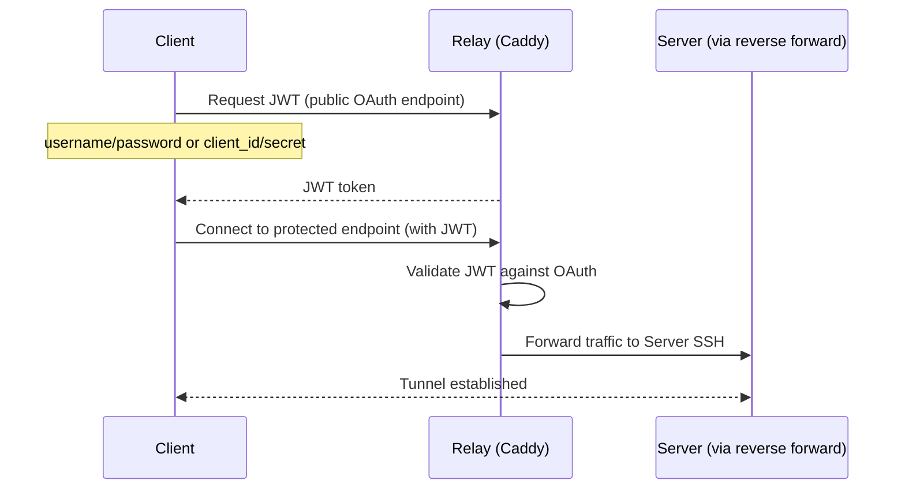

# Tunnel Whisperer — Architecture

> Based on the [arc42](https://arc42.org) template.

---

## 1. Introduction and Goals

Tunnel Whisperer creates resilient, application-layer bridges for specific ports across separated private networks. It encapsulates traffic in standard HTTPS/WebSocket to traverse strict firewalls, NAT, and DPI-controlled environments.

### 1.1 Requirements Overview

The system connects a **server** behind a private network to **clients** behind other private networks, via a publicly reachable **relay**. All connectivity is egress-only from both sides. The relay is fully provisioned and managed by the server — no manual infrastructure setup is required.

### 1.2 Quality Goals

| Priority | Goal | Description |
| -------- | ---- | ----------- |
| 1 | Firewall traversal | Only port 443 (HTTPS) is exposed; compatible with strict corporate firewalls and DPI |
| 2 | Zero inbound ports | Neither client nor server requires any inbound connectivity |
| 3 | Transport resilience | Xray provides robust tunneling over TLS/WebSocket, surviving network disruptions |
| 4 | Session security | SSH handles authentication, encryption, and port-level access semantics |
| 5 | Automated provisioning | The relay is fully deployed, configured, and updated by the server |

---

## 3. System Scope and Context

### 3.1 Business Context



### 3.2 Technical Context

| Protocol | Port | Direction | Purpose |
| -------- | ---- | --------- | ------- |
| TLS (Xray VLESS+WS) | 443 | Server → Relay | Transport tunnel for SSH reverse forwarding |
| TLS (Xray VLESS+WS) | 443 | Client → Relay | Transport tunnel for SSH local forwarding |
| HTTPS (Caddy) | 443 | External → Relay | TLS termination, OAuth endpoint, reverse proxy |
| HTTP | 80 | External → Relay | ACME challenge for certificate issuance |
| SSH | 22 | Server → Relay | Initial relay provisioning and config management |
| SSH (over Xray) | — | End-to-end | Reverse port forwarding and session security |
| gRPC | 50051 | Local | Server API for dashboard and tooling |

---

## 4. Solution Strategy

| Challenge | Solution | Technology |
| --------- | -------- | ---------- |
| Firewalls block non-HTTPS traffic | Encapsulate all traffic in TLS on port 443 | Xray (VLESS + WebSocket) |
| Server and client are behind NAT | All connections are outbound-only; relay is the rendezvous point | SSH reverse port forwarding |
| Relay must never see plaintext | End-to-end encryption between client and server | SSH session layer |
| TLS certificates for the relay | Automatic issuance and renewal | Caddy (ACME / Let's Encrypt) |
| Client authentication | OAuth + JWT before tunnel access is granted | Caddy (OAuth proxy) |
| Infrastructure provisioning | Server automates relay deployment via cloud APIs | AWS SDK (EC2, Route53, SG) |
| Cross-platform operation | Single binary for both server and client | Go (Linux + Windows) |

---

## 5. Building Block View

### 5.1 Level 1 — System Overview

#### Server

`tw` is a Go binary released for both Windows and Linux. The server brings up two internal services:

* **Core Service** — runs all commands (relay provisioning, key generation, tunnel management)
* **API Service** — a gRPC service that exposes core service operations

#### Relay

The relay is a lightweight cloud instance provisioned and managed entirely by the server. It runs:

* **Caddy** — reverse proxy, automatic TLS certificate issuance for the subdomain, and OAuth authentication
* **Xray** — transport layer for tunneling traffic over TLS/WebSocket

The server controls the relay's configuration at any time via SSH (using a key pair generated during provisioning).

> For the initial release, only **AWS** is supported as the relay provider. More providers will follow in future releases.

#### Client

The client is the same `tw` binary connecting to the relay to reach services exposed by the server.

### 5.2 Level 2 — Project Structure

```text
tw/
├── cmd/
│   └── tw/                      # binary entry point
├── internal/
│   ├── cli/                     # cobra commands (init, dashboard, connect)
│   ├── core/                    # core service — orchestrates all operations
│   ├── api/                     # gRPC API service
│   ├── provider/                # cloud provider interface + implementations
│   │   └── aws/                 # AWS provider (EC2, Route53, SG)
│   ├── relay/                   # relay config generation
│   │   ├── caddy/               # Caddyfile templating
│   │   └── xray/                # Xray config templating
│   ├── ssh/                     # SSH key management & tunneling
│   ├── auth/                    # OAuth provider & JWT validation
│   ├── tunnel/                  # tunnel lifecycle (server & client side)
│   └── dashboard/               # HTTP server serving embedded web UI
├── proto/                       # gRPC protobuf definitions
│   └── api/v1/
├── deploy/                      # relay config templates (go:embed)
│   ├── caddy/
│   └── xray/
├── web/                         # frontend SPA source
├── go.mod
├── go.sum
└── Makefile
```

---

## 6. Runtime View

### 6.1 Relay Provisioning

Everything starts from the server.



### 6.2 Phase 1 — Server ↔ Relay Setup

1. A **UUID** is generated for the server and set in the Xray config on the relay, so the server can connect.
2. The server uses **Xray + SSH** to reach the relay and performs **reverse port forwarding** (`ssh -R`) of its **SSH port** and **OAuth port**.
3. On the relay, Caddy is configured with two reverse proxies:
   * **Public endpoint** → forwards to the server's OAuth service (authentication provider)
   * **Protected endpoint** → requires a valid JWT (authenticated by the OAuth endpoint above)



### 6.3 Phase 2 — Client Connection

1. The client attempts to connect to the relay via Xray.
2. Caddy intercepts and requires authentication first.
3. The client authenticates against the **public OAuth endpoint** (username/password or client ID/secret) and receives a **JWT**.
4. The client connects to the **protected Caddy endpoint**, presenting the JWT.
5. Caddy validates the JWT against the OAuth provider and, if valid, forwards traffic to the server's SSH port.



---

## 7. Deployment View

### 7.1 Linux

```bash
# install as a systemd service, enable, and start it
tw init --as-server

# bring up the dashboard UI (calls the API service)
tw dashboard
```

### 7.2 Windows

```powershell
# install as a Windows service, set to automatic, and start it
tw.exe init --as-server

# bring up the dashboard UI (calls the API service)
tw dashboard
```
