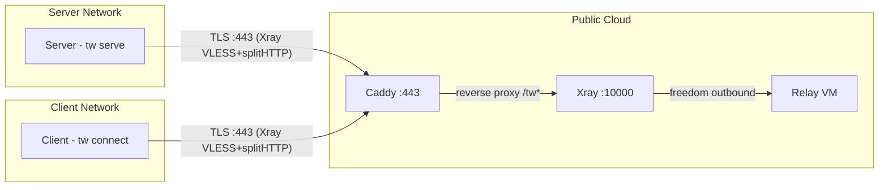
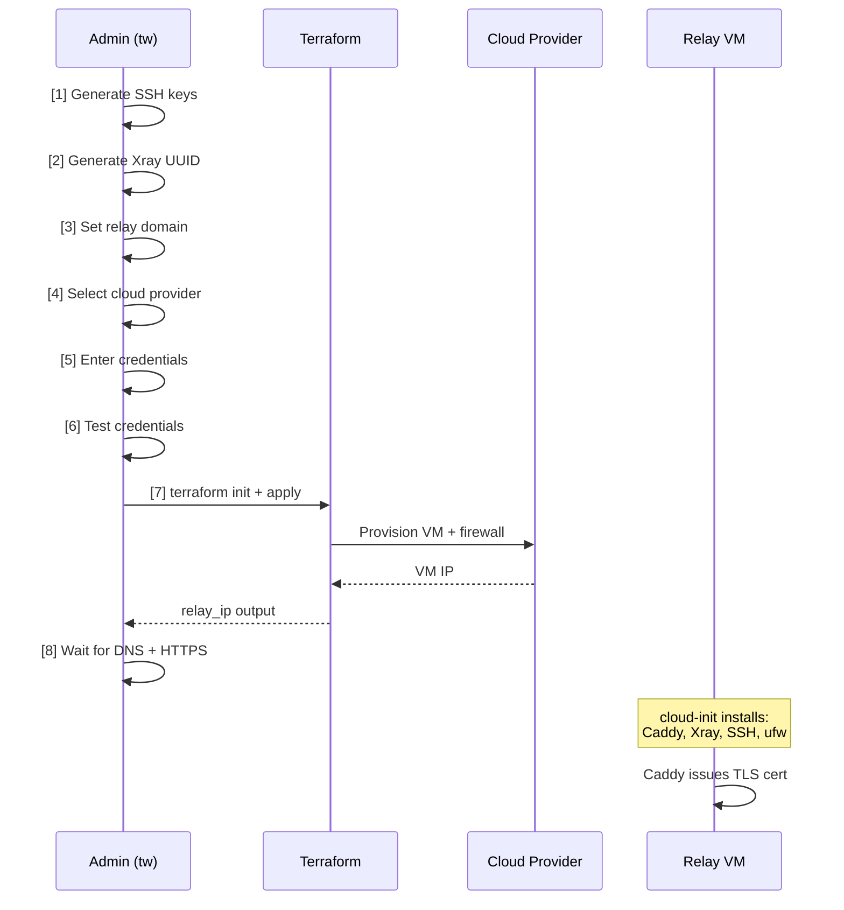
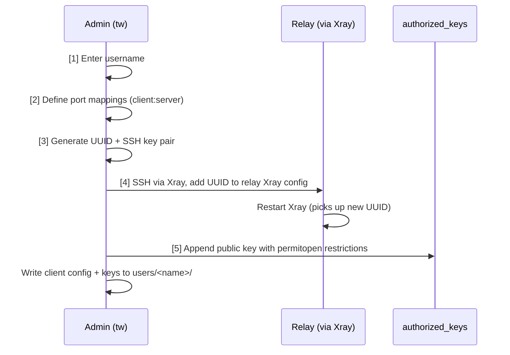
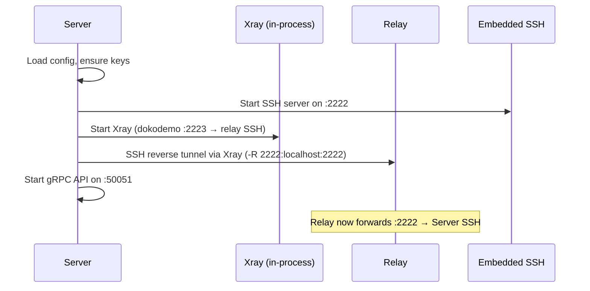
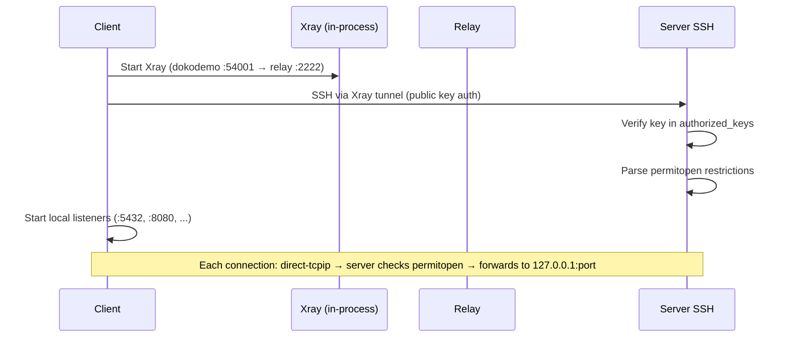

# Tunnel Whisperer — Architecture

> Based on the [arc42](https://arc42.org) template.

---

## 1. Introduction and Goals

Tunnel Whisperer creates resilient, application-layer bridges for specific ports across separated private networks. It encapsulates traffic in standard HTTPS to traverse strict firewalls, NAT, and DPI-controlled environments.

### 1.1 Requirements Overview

The system connects a **server** behind a private network to **clients** behind other private networks, via a publicly reachable **relay**. All connectivity is egress-only from both sides. The relay is provisioned and managed by the server operator via an interactive CLI wizard.

### 1.2 Quality Goals

| Priority | Goal | Description |
| -------- | ---- | ----------- |
| 1 | Firewall traversal | Only port 443 (HTTPS) is exposed; compatible with strict corporate firewalls and DPI |
| 2 | Zero inbound ports | Neither client nor server requires any inbound connectivity |
| 3 | Transport resilience | Xray provides robust tunneling over TLS/splitHTTP, surviving network disruptions |
| 4 | Session security | SSH handles authentication, encryption, and port-level access control |
| 5 | Per-user lockdown | Each client is restricted to specific localhost ports via `permitopen` |

---

## 3. System Scope and Context

### 3.1 Business Context



### 3.2 Technical Context

| Protocol | Port | Direction | Purpose |
| -------- | ---- | --------- | ------- |
| TLS (Xray VLESS+splitHTTP) | 443 | Server → Relay | Transport tunnel for SSH reverse forwarding |
| TLS (Xray VLESS+splitHTTP) | 443 | Client → Relay | Transport tunnel for SSH local forwarding |
| HTTPS (Caddy) | 443 | External → Relay | TLS termination, reverse proxy to Xray |
| HTTP | 80 | External → Relay | ACME challenge for Let's Encrypt certificate issuance |
| SSH (over Xray) | — | End-to-end | Reverse/local port forwarding and session security |
| SSH (embedded) | 2222 | Local | Server's embedded SSH server (Go `x/crypto/ssh`) |
| gRPC | 50051 | Local | Server API for dashboard and tooling |

**Not exposed on the relay:** SSH port 22 is bound to `127.0.0.1` only and reachable exclusively through the Xray tunnel. The relay firewall allows only ports 80 and 443.

---

## 4. Solution Strategy

| Challenge | Solution | Technology |
| --------- | -------- | ---------- |
| Firewalls block non-HTTPS traffic | Encapsulate all traffic in TLS on port 443 | Xray (VLESS + splitHTTP) |
| Server and client are behind NAT | All connections are outbound-only; relay is the rendezvous point | SSH reverse port forwarding |
| Relay must never see plaintext | End-to-end encryption between client and server | SSH session layer |
| TLS certificates for the relay | Automatic issuance and renewal | Caddy (ACME / Let's Encrypt) |
| Per-user access control | Public key auth with port restrictions | SSH `authorized_keys` + `permitopen` |
| Infrastructure provisioning | Interactive wizard generates Terraform + cloud-init | Terraform (Hetzner, DigitalOcean, AWS) |
| Cross-platform operation | Single binary for both server and client | Go (Linux + Windows) |
| Dynamic user management | Re-read authorized_keys on every auth attempt | No server restart needed |

---

## 5. Building Block View

### 5.1 Level 1 — System Overview

#### Server (`tw serve`)

The server brings up four internal services:

* **SSH Server** — an embedded SSH server (Go `golang.org/x/crypto/ssh`) that listens on a configurable port (default `:2222`), supports `direct-tcpip` port forwarding, reads `authorized_keys` dynamically, and enforces `permitopen` restrictions per client key
* **Xray Instance** — in-process xray-core creating a VLESS+splitHTTP+TLS tunnel to the relay
* **Reverse Tunnel** — SSH reverse port forward (`-R`) through Xray, exposing the server's SSH on the relay
* **API Server** — a gRPC service exposing status and management operations

#### Relay

The relay is a lightweight cloud VM provisioned via `tw create relay-server`. It runs:

* **Caddy** — reverse proxy on `:443`, automatic TLS via Let's Encrypt, forwards `/tw*` to Xray
* **Xray** — VLESS inbound on `127.0.0.1:10000` with freedom outbound, accepts multiple client UUIDs
* **SSH** — OpenSSH on `127.0.0.1:22` only, accessible exclusively through the Xray tunnel
* **Firewall (ufw)** — only ports 80 and 443 open

Supported cloud providers: **Hetzner**, **DigitalOcean**, **AWS**.

#### Client (`tw connect`)

The client starts:

* **Xray Instance** — in-process xray-core with dokodemo-door inbound forwarding to the server's SSH port on the relay
* **Forward Tunnel** — SSH local port forward (`-L`) through Xray, mapping local ports to server services

### 5.2 Level 2 — Project Structure

```text
tw/
├── cmd/
│   └── tw/                         # binary entry point
├── internal/
│   ├── cli/                        # cobra commands
│   │   ├── root.go                 # root command + flags
│   │   ├── serve.go                # tw serve
│   │   ├── connect.go              # tw connect
│   │   ├── create_relay.go         # tw create relay-server
│   │   ├── create_user.go          # tw create user
│   │   └── dashboard.go            # tw dashboard
│   ├── config/                     # YAML config, platform-specific paths
│   ├── core/                       # core service orchestrator
│   ├── api/                        # gRPC API service
│   ├── ssh/                        # SSH key generation, embedded server, forward/reverse tunnels
│   │   ├── server.go               # embedded SSH server with dynamic auth + permitopen
│   │   ├── forward.go              # client-side local port forwarding (-L)
│   │   ├── reverse.go              # server-side reverse port forwarding (-R)
│   │   └── keygen.go               # ed25519 key pair generation
│   ├── xray/                       # in-process xray-core (VLESS + splitHTTP + TLS)
│   ├── relay/
│   │   └── terraform/              # cloud-init + Terraform templates (go:embed)
│   │       ├── cloud-init.yaml.tmpl
│   │       ├── aws.tf.tmpl
│   │       ├── hetzner.tf.tmpl
│   │       ├── digitalocean.tf.tmpl
│   │       └── generate.go         # template rendering + file generation
│   ├── dashboard/                  # HTTP server serving status page
│   └── provider/                   # cloud provider abstraction (stubs)
├── proto/                          # gRPC protobuf definitions
│   └── api/v1/
├── docs/
│   └── architecture/
├── go.mod
├── go.sum
└── Makefile
```

---

## 6. Runtime View

### 6.1 Relay Provisioning (`tw create relay-server`)

Interactive 8-step wizard:



The cloud-init script on the relay:

1. Creates the SSH user with sudo and the server's public key
2. Installs Caddy (apt), Xray (official install script)
3. Writes Xray config (VLESS inbound on `127.0.0.1:10000`)
4. Writes Caddyfile (reverse proxy `/tw*` to Xray)
5. Locks down SSH to `127.0.0.1` only
6. Configures firewall: deny all incoming, allow 80/tcp + 443/tcp

### 6.2 User Creation (`tw create user`)

Interactive 5-step wizard:



The generated `authorized_keys` entry:

```
permitopen="127.0.0.1:5432",permitopen="127.0.0.1:8080" ssh-ed25519 AAAA... alice@tw
```

This restricts the client to forwarding only to the specified `127.0.0.1` ports on the server. No access to the server's wider network.

### 6.3 Server Startup (`tw serve`)



### 6.4 Client Connection (`tw connect`)



### 6.5 Data Flow (End-to-End)

```text
Client app                                                            Server service
    │                                                                       ▲
    ▼                                                                       │
localhost:5432 ──▶ SSH channel (direct-tcpip) ──▶ 127.0.0.1:5432
    │                        │                            ▲
    ▼                        ▼                            │
Xray dokodemo    VLESS+splitHTTP+TLS     Xray freedom    SSH reverse tunnel
(:54001)         ─────────────────▶      (:10000)        (:2222 on relay)
                      Relay                                     │
                  Caddy :443                                    │
                  (TLS termination)                    Server SSH :2222
```

---

## 7. Deployment View

### 7.1 Configuration

Default `config.yaml`:

```yaml
xray:
  uuid: ""                       # auto-generated on first run
  relay_host: ""                 # e.g. relay.example.com
  relay_port: 443
  path: /tw

server:                          # only needed for `tw serve`
  ssh_port: 2222
  api_port: 50051
  dashboard_port: 8080
  relay_ssh_port: 22
  relay_ssh_user: ubuntu
  remote_port: 2222              # port exposed on relay for clients

client:                          # only needed for `tw connect`
  ssh_user: tunnel
  server_ssh_port: 2222          # server's SSH port on relay
  tunnels:
    - local_port: 5432           # listen on client localhost
      remote_host: 127.0.0.1    # target on server (localhost only)
      remote_port: 5432          # PostgreSQL
```

### 7.2 File Layout (Server)

```text
/etc/tw/config/                  # or C:\ProgramData\tw\config\ on Windows
├── config.yaml                  # server configuration
├── id_ed25519                   # server SSH private key
├── id_ed25519.pub               # server SSH public key
├── ssh_host_ed25519_key         # SSH host key
├── authorized_keys              # client public keys (with permitopen)
├── relay/                       # Terraform state + generated files
│   ├── main.tf                  # provider-specific Terraform
│   ├── cloud-init.yaml          # rendered cloud-init
│   ├── terraform.tfstate
│   └── terraform.tfvars         # cloud credentials (Hetzner/DO)
└── users/                       # per-user client configs
    └── alice/
        ├── config.yaml          # client config (send to client)
        ├── id_ed25519           # client private key (send to client)
        └── id_ed25519.pub       # client public key
```

### 7.3 File Layout (Client)

```text
/etc/tw/config/                  # or C:\ProgramData\tw\config\ on Windows
├── config.yaml                  # client configuration (from server admin)
├── id_ed25519                   # client SSH private key (from server admin)
└── id_ed25519.pub               # client SSH public key
```

### 7.4 Building

Requires **Go 1.22+**.

```bash
# Linux
go build -o bin/tw ./cmd/tw

# Windows (cross-compile from Linux)
GOOS=windows GOARCH=amd64 go build -o bin/tw.exe ./cmd/tw
```

### 7.5 What `tw serve` Starts

1. Loads (or creates) `config.yaml` from the platform config directory
2. Generates an ed25519 SSH key pair (`id_ed25519` / `id_ed25519.pub`) if missing
3. Generates an ed25519 host key (`ssh_host_ed25519_key`) for the embedded SSH server
4. Seeds `authorized_keys` with the server's own public key
5. Starts the **embedded SSH server** on the configured port (default `:2222`)
   * Dynamic `authorized_keys` — re-read on every authentication attempt
   * `permitopen` enforcement — restricts port forwarding per client key
6. If `xray.relay_host` is set:
   * Starts **Xray** in-process (dokodemo-door → VLESS/splitHTTP/TLS to relay)
   * Opens an **SSH reverse tunnel** through Xray to the relay (`-R remote_port:localhost:ssh_port`)
7. Starts the **gRPC API server** on the configured port (default `:50051`)

---

## 8. Cross-cutting Concepts

### 8.1 Auto-Reconnection

Both the forward tunnel (client) and reverse tunnel (server) implement exponential backoff reconnection:

* **Backoff:** 2s → 4s → 8s → 16s → 30s (max)
* **Keepalive:** SSH keepalive every 15 seconds; on failure, triggers reconnect
* **TCP Keepalive:** 30-second TCP keepalive on all connections

### 8.2 Dynamic User Management

The SSH server re-reads `authorized_keys` on every authentication attempt. This means:

* `tw create user` takes effect immediately — no need to restart `tw serve`
* Revoking a user (removing their key from `authorized_keys`) takes effect on the next connection attempt
* Each key entry can have independent `permitopen` restrictions

### 8.3 Relay Config Updates

`tw create user` updates the relay's Xray config remotely:

1. Starts a temporary Xray instance (on port 59001, separate from `tw serve`)
2. SSHs into the relay through the temporary tunnel
3. Reads, modifies, and writes `/usr/local/etc/xray/config.json` (via `sudo`)
4. Restarts Xray on the relay (which kills the temporary tunnel — expected)

### 8.4 Transport Protocol

Xray VLESS + splitHTTP over TLS:

* **VLESS:** Lightweight proxy protocol with UUID-based authentication
* **splitHTTP:** HTTP-based transport that splits data into standard HTTP requests/responses
* **TLS:** Terminated by Caddy on the relay; SNI matches the relay domain
* **Result:** Traffic is indistinguishable from normal HTTPS browsing to firewalls and DPI
